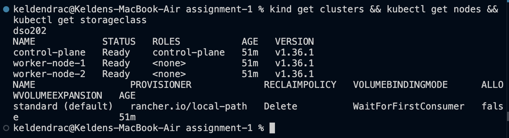
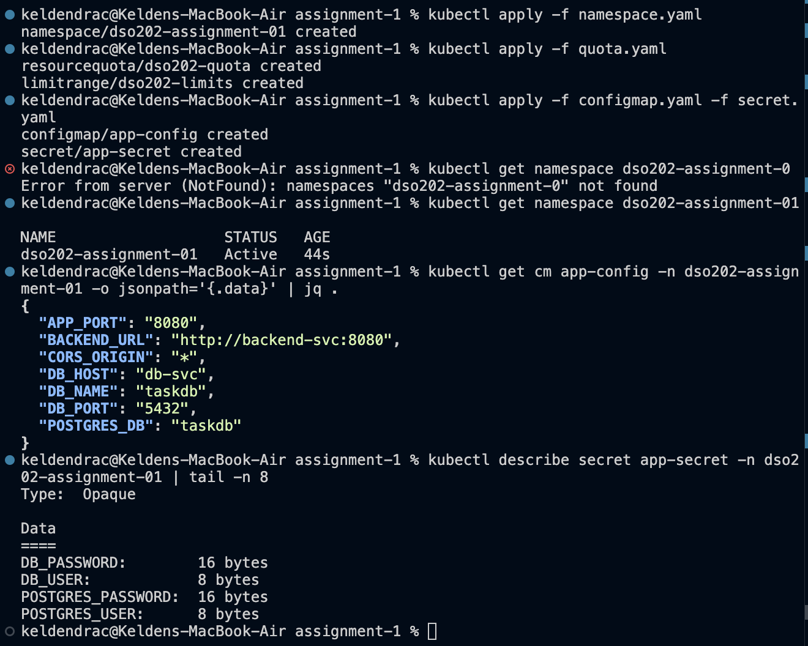
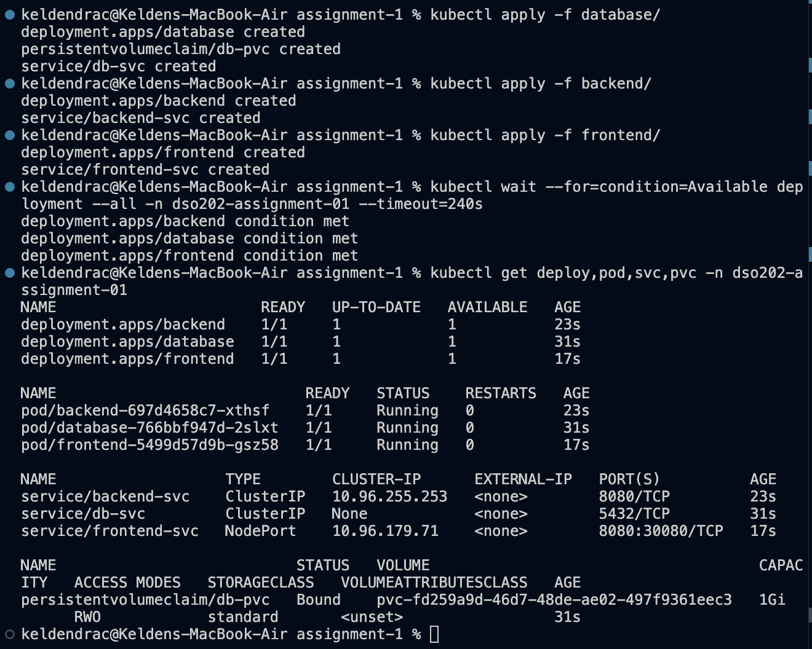
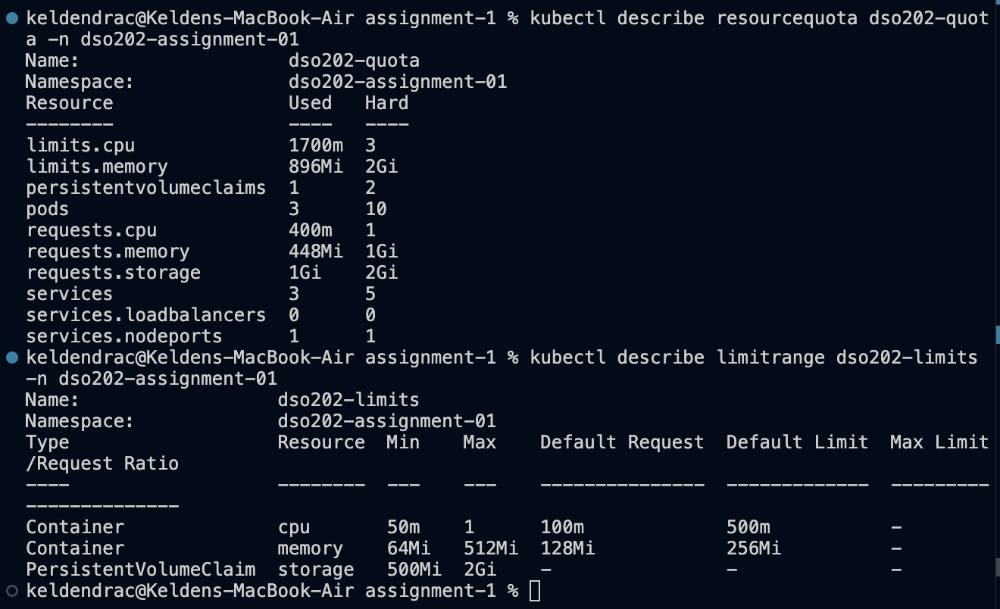
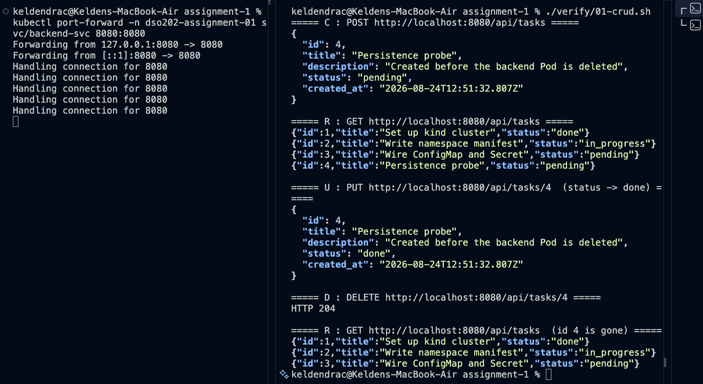
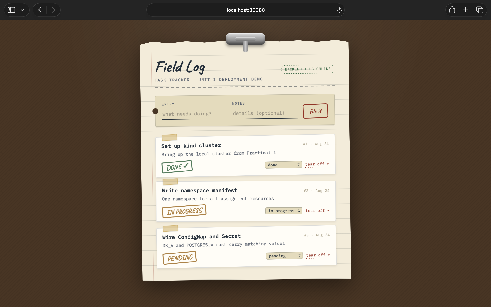
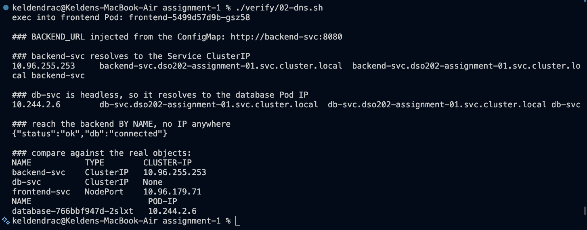
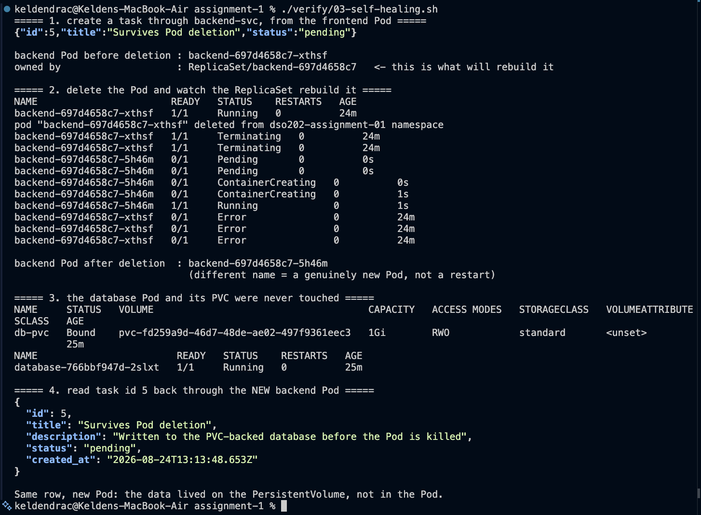
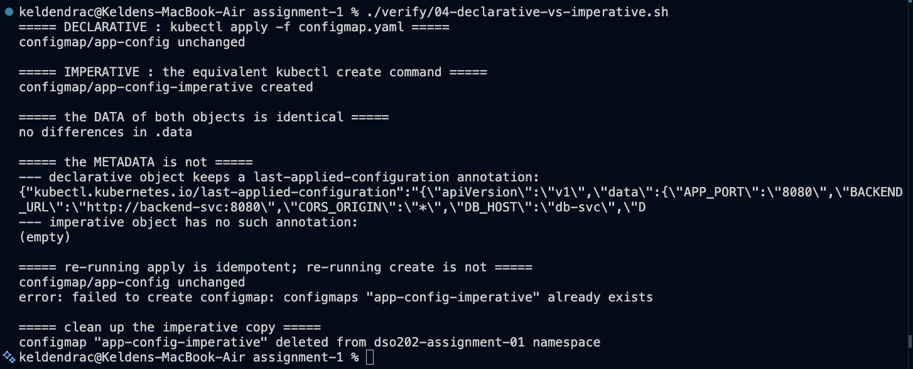
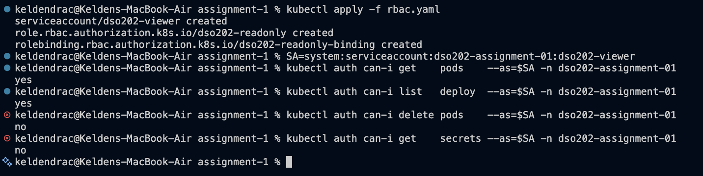

# DSO202 - Assignment 1: Three-Tier Application Deployment on Kubernetes

A pre-built three-tier Task Tracker (nginx frontend → Node.js REST backend → PostgreSQL)
deployed entirely through declarative Kubernetes manifests. No application code was written;
all of the work here is the Kubernetes configuration.

| Tier | Image (pinned tag, never `latest`) | Internal port | Service |
|---|---|---|---|
| Frontend | `sarojsanyasi/dso202-frontend:1.0` | 8080 | `frontend-svc` - NodePort 30080 |
| Backend | `sarojsanyasi/dso202-backend:1.0` | 8080 | `backend-svc` - ClusterIP |
| Database | `sarojsanyasi/dso202-db:1.0` | 5432 | `db-svc` - headless (`clusterIP: None`) |

---

## 1. Repository layout

```
assignment-1/
├── namespace.yaml              Task 1  - namespace
├── configmap.yaml              Task 2  - all non-sensitive configuration
├── secret.yaml                 Task 2  - all credentials
├── quota.yaml                  Task 6  - ResourceQuota + LimitRange
├── rbac.yaml                   Task 8  - bonus: read-only ServiceAccount/Role/RoleBinding
├── cluster/
│   └── kind-cluster.yaml       Practical 1 cluster config (defines the 30080 port mapping)
├── database/
│   ├── pvc.yaml                Task 3  - PersistentVolumeClaim
│   ├── deployment.yaml         Task 3  - single-replica, Recreate strategy
│   └── service.yaml            Task 3  - headless Service
├── backend/
│   ├── deployment.yaml         Task 4
│   └── service.yaml            Task 4  - ClusterIP
├── frontend/
│   ├── deployment.yaml         Task 5
│   └── service.yaml            Task 5  - NodePort 30080
├── verify/                     the scripts that produced the Task 7 evidence
│   ├── 01-crud.sh
│   ├── 02-dns.sh
│   ├── 03-self-healing.sh
│   └── 04-declarative-vs-imperative.sh
├── evidence/                   screenshots 01-10
└── README.md
```

## 2. Deploying from scratch

The `kind` cluster must exist first, created with the `extraPortMappings` entry that maps
`containerPort: 30080` to `hostPort: 30080` - without it the frontend's NodePort is not
reachable from a browser and `kubectl port-forward` must be used instead.

```bash
kind create cluster --config cluster/kind-cluster.yaml
kind get clusters && kubectl get nodes && kubectl get storageclass
```



Three nodes `Ready` on v1.36.1, and a default StorageClass `standard`
(`rancher.io/local-path`) for the database PVC in Task 3 to bind against. With the
prerequisite confirmed, apply the manifests:

```bash
kubectl apply -f namespace.yaml
kubectl apply -f quota.yaml                        # governance before any Pod is admitted
kubectl apply -f configmap.yaml -f secret.yaml
kubectl apply -f database/
kubectl apply -f backend/
kubectl apply -f frontend/
kubectl apply -f rbac.yaml                         # optional bonus

kubectl wait --for=condition=Available deployment --all -n dso202-assignment-01 --timeout=240s
```

Order matters in one place only: `quota.yaml` is applied before any workload so that the
LimitRange is already admitting containers when the first Pod is created.

---

## 3. Architecture note (Task 1)

**Namespace.** `dso202-assignment-01` is the tenancy boundary for every object here. It scopes
names (so `db-svc` cannot collide with another module's `db-svc`), it gives the ResourceQuota
and LimitRange something to attach to, and it supplies the middle segment of every Service's
DNS name - `backend-svc.dso202-assignment-01.svc.cluster.local`.

**What happens when a manifest is applied.** `kubectl apply` sends the object to the
**kube-apiserver**, which authenticates the request, runs admission control, and persists the
result in **etcd**. Two admission controllers matter for this assignment: `LimitRanger`, which
stamps default requests and limits onto any container that omits them, and `ResourceQuota`,
which rejects the Pod outright if admitting it would breach the namespace ceiling.

For each tier the **Deployment controller** (inside kube-controller-manager) observes the new
Deployment and creates a ReplicaSet; the **ReplicaSet controller** then creates the Pod object.
At that point the Pod has no node. The **kube-scheduler** filters the three nodes for ones that
can satisfy the Pod's CPU and memory *requests*, scores the survivors, and writes `nodeName`
back through the API server. In this deployment the scheduler placed the database on
`worker-node-1` and the backend and frontend on `worker-node-2` - the control-plane node ran
none of them.

On the chosen node, that node's **kubelet** sees a Pod bound to it, pulls the image through the
**container runtime** (containerd) and starts the container. For the database Pod the kubelet
additionally waits for the volume to be mounted before starting the container. Meanwhile
**kube-proxy** on every node programs the dataplane rules that make `backend-svc`'s ClusterIP
and `frontend-svc`'s NodePort routable, and **CoreDNS** publishes the A records that let one Pod
find another by Service name. The headless `db-svc` is the exception: it gets a DNS record but
no kube-proxy rules at all, because there is no virtual IP to load-balance.

**Storage.** The database PVC uses kind's default StorageClass (`standard`,
`rancher.io/local-path`), whose binding mode is `WaitForFirstConsumer`. The **PersistentVolume
controller** therefore deliberately leaves the claim `Pending` until the scheduler has picked a
node, so the volume is provisioned on the node the Pod actually landed on.

**Objects chosen per tier, and why:**

| Tier | Objects | Reasoning |
|---|---|---|
| Database | Deployment (1 replica, `Recreate`) + PVC + headless Service | One replica because PostgreSQL is not made highly available by raising `replicas`, and the ReadWriteOnce PVC can only be mounted by one node anyway. `Recreate` because the default RollingUpdate would try to start a second Pod holding the same RWO volume before releasing the first, and hang. Headless because a single database Pod should be addressed directly, not through a load-balancing VIP. A StatefulSet would be the right answer for a replicated database with per-replica volumes and stable ordinals - none of which a single-replica PostgreSQL needs, and StatefulSets sit outside Unit I. |
| Backend | Deployment + ClusterIP Service | Stateless, so a Deployment is the natural controller. ClusterIP keeps it reachable from the frontend but invisible from outside the cluster, which is a non-negotiable constraint. |
| Frontend | Deployment + NodePort Service | Stateless and horizontally scalable. NodePort is the only Unit I mechanism that exposes a Service to the host, and 30080 is the port the kind cluster was built to forward. |

---

## 4. Configuration and Secrets (Task 2)

The backend and the database expect **different names for the same values**. The backend reads
`DB_NAME` / `DB_USER` / `DB_PASSWORD`; the official PostgreSQL image reads `POSTGRES_DB` /
`POSTGRES_USER` / `POSTGRES_PASSWORD`. Supplying only one set leaves the other tier
misconfigured - the backend would authenticate against a role that was never created.

Both sets are therefore declared side by side, with the pairing visible in one place:

| Key | Object | Consumed by | Paired with |
|---|---|---|---|
| `DB_HOST` = `db-svc` | ConfigMap | backend | - (the database Service name) |
| `DB_PORT` = `5432` | ConfigMap | backend | - |
| `DB_NAME` = `taskdb` | ConfigMap | backend | **`POSTGRES_DB`** |
| `APP_PORT` = `8080` | ConfigMap | backend | - |
| `CORS_ORIGIN` = `*` | ConfigMap | backend | - |
| `POSTGRES_DB` = `taskdb` | ConfigMap | database | **`DB_NAME`** |
| `BACKEND_URL` = `http://backend-svc:8080` | ConfigMap | frontend | - |
| `DB_USER` | Secret | backend | **`POSTGRES_USER`** |
| `DB_PASSWORD` | Secret | backend | **`POSTGRES_PASSWORD`** |
| `POSTGRES_USER` | Secret | database | **`DB_USER`** |
| `POSTGRES_PASSWORD` | Secret | database | **`DB_PASSWORD`** |

Every Deployment consumes keys **individually** via `configMapKeyRef` / `secretKeyRef` rather
than pulling the whole object in with `envFrom`. That is deliberate: `envFrom` would inject
`POSTGRES_*` into the backend and `DB_*` into PostgreSQL, where they are dead weight at best and
misleading at worst. Explicit keys make each tier's contract readable from its own manifest.



### Secret encoding caveat - required note

**Kubernetes Secrets are base64-encoded, not encrypted.** Base64 is a reversible transport
encoding with no key, so anyone who can read `secret.yaml`, or who can run
`kubectl get secret app-secret -o yaml`, can recover the credential with a single
`base64 -d`. By default a Secret is also written to **etcd unencrypted** - encryption at rest
requires an `EncryptionConfiguration` provider enabled on the API server, and stronger setups
replace the mechanism entirely with an external manager (Vault, Sealed Secrets, a cloud KMS
via the Secrets Store CSI driver).

This is documented rather than fixed, as the assignment specifies: encryption at rest is a
cluster-level concern outside Unit I. What *is* done within scope is keeping credentials out of
every other manifest - no ConfigMap, Deployment, or Service in this repository contains a
credential in plaintext. The screenshot above shows the Secret's keys reported as byte counts,
which is what `kubectl describe secret` deliberately prints instead of the values.

The bonus Role in §8 reinforces the same point by excluding `secrets` from its read verbs:
because the value is only encoded, **read access to a Secret is equivalent to holding the
credential**.

---

## 5. The three tiers (Tasks 3-5)



One frame, five things proved: three Deployments at `1/1`; three Pods `Running`; `db-pvc`
**Bound** to a 1Gi ReadWriteOnce volume on StorageClass `standard`; and all three Service types
distinguishable - `db-svc` with `CLUSTER-IP: None` (headless), `backend-svc` as a plain
ClusterIP with no node port, and `frontend-svc` as `NodePort 8080:30080/TCP`.

**Database (Task 3).** The PVC is mounted at `/var/lib/postgresql/data`, the official image's
data path, so the database's state lives on the volume rather than the container's writable
layer. This is what makes §7c possible. The Deployment consumes `POSTGRES_*` only.

**Backend (Task 4).** Consumes `DB_*` only, with `DB_HOST` set to the Service *name*, not an IP -
the database Pod can be rescheduled onto a different node with a different address and `db-svc`
keeps resolving. The image retries the database connection with backoff at startup, which is why
`kubectl logs` shows a short run of `[db] not reachable yet` before `[db] connected` on a cold
start. Unit I uses no readiness probes, so this in-image resilience is what removes any
dependence on Pod startup ordering.

**Frontend (Task 5).** Consumes `BACKEND_URL` only. The image's entrypoint runs `envsubst` at
container start to render that value into `config.js` before nginx serves anything, so the
backend address is never baked in at build time. The container listens on 8080 rather than 80
because it runs as a non-root user.

---

## 6. Namespace resource governance (Task 6)



The two objects do different jobs. The **ResourceQuota** is a ceiling on the namespace as a
whole. The **LimitRange** works per container: it supplies defaults when a container declares no
resources, and enforces a floor and a ceiling on what any single container may declare.

### How the numbers were derived

Steady-state demand comes from the three workloads themselves:

| Tier | CPU request | Memory request | CPU limit | Memory limit |
|---|---|---|---|---|
| frontend (nginx, static files) | 50m | 64Mi | 200m | 128Mi |
| backend (Node.js + pg client) | 100m | 128Mi | 500m | 256Mi |
| database (PostgreSQL 17) | 250m | 256Mi | 1 | 512Mi |
| **total** | **400m** | **448Mi** | **1700m** | **896Mi** |

Those totals are visible as the quota's `Used` column in the screenshot, which is the check that
the reasoning below matches reality.

The ceiling is then set against the **worst case, not the steady state**. During a rolling
update the frontend and backend each briefly run a surge replica; the database does not, because
it uses `strategy: Recreate`. Worst case is therefore 550m CPU / 640Mi requested and 2400m CPU /
1280Mi limited. Every figure sits just above that:

| Quota key | Value | Why |
|---|---|---|
| `requests.cpu` | `1` | ~2× steady state, ~1.8× worst-case rollout |
| `requests.memory` | `1Gi` | above the 640Mi rollout peak |
| `limits.cpu` | `3` | above the 2400m rollout peak |
| `limits.memory` | `2Gi` | above the 1280Mi rollout peak |
| `pods` | `10` | 3 steady + surge, with room for a debug Pod |
| `services` | `5` | 3 in use |
| `persistentvolumeclaims` | `2` | 1 in use; the spare allows a restore/migration PVC without editing the quota |
| `requests.storage` | `2Gi` | 1Gi in use, matching the PVC slot above |
| `services.nodeports` | `1` | **enforces a non-negotiable constraint** |
| `services.loadbalancers` | `0` | same |

The sizing rule throughout is *headroom above the worst case, not above the average*. A quota
tight enough to fit only the steady state would deadlock the first rolling update - the surge
Pod would be rejected and the rollout would stall - which is a far more disruptive failure than
the over-consumption the quota exists to prevent.

`services.nodeports: 1` is the entry worth singling out. The screenshot shows it at **1 used of
1 hard**: the namespace has spent its only NodePort on the frontend, so the backend and database
cannot be exposed outside the cluster even by accident. The constraint is enforced by the
cluster rather than merely respected by the author, and `services.loadbalancers: 0` closes the
other route.

### LimitRange values

| Setting | cpu | memory | Reasoning |
|---|---|---|---|
| `defaultRequest` | 100m | 128Mi | a modest workload's realistic idle draw |
| `default` (limit) | 500m | 256Mi | headroom for a burst without monopolising a node |
| `min` | 50m | 64Mi | below this a container only fragments allocatable capacity |
| `max` | 1 | 512Mi | the database's own limit; nothing here is heavier |

A PersistentVolumeClaim limit of 500Mi-2Gi is included so a claim cannot be sized outside what
the quota's `requests.storage` can actually accommodate.

Although all three Deployments set their resources explicitly, the LimitRange is not redundant:
it guarantees that any Pod created *later* - an imperative `kubectl run`, a debug container -
still arrives with requests attached, and so is counted by the quota instead of being rejected
for declaring nothing at all.

---

## 7. Verification and interactivity (Task 7)

### 7a - Full CRUD cycle

`backend-svc` is ClusterIP and therefore unreachable from the host by design, so a temporary
`kubectl port-forward` tunnel was opened through the API server for the demonstration. This
creates no NodePort and no lasting exposure; it lives only as long as the command runs.

```bash
kubectl port-forward -n dso202-assignment-01 svc/backend-svc 8080:8080   # terminal A
./verify/01-crud.sh                                                       # terminal B
```



The left pane shows the tunnel open and handling connections; the right pane runs the full
cycle - `POST` returns the new task with `id: 4`, `GET` lists it alongside the three seeded rows,
`PUT` returns `"status": "done"`, `DELETE` returns `HTTP 204`, and the final `GET` shows id 4
gone.

The same cycle is also available through the frontend UI:



`localhost:30080` in the address bar confirms the NodePort Service and the kind
`extraPortMappings` entry line up, the **BACKEND + DB ONLINE** badge confirms the frontend
reached the backend and the backend reached PostgreSQL, and the three seeded rows confirm the
image's `01-init.sql` seed ran against the PVC-backed volume. Each row carries a status
dropdown and a *tear off* control, so update and delete are driven from the page.

> **Note on reaching the UI's backend.** `BACKEND_URL` is `http://backend-svc:8080` exactly as
> Task 5 requires - a cluster-internal address. The page's JavaScript runs in a browser *outside*
> the cluster, which has no access to cluster DNS, so for this screenshot the host was given a
> matching alias (`127.0.0.1  backend-svc` in `/etc/hosts`) alongside the port-forward already
> running for the CRUD test. Nothing in the cluster changed and `BACKEND_URL` was not modified;
> the alias only lets a browser resolve the same name a Pod resolves natively. It was removed
> afterwards. The curl transcript above is the primary evidence for this task, as the brief
> permits.

### 7b - Service DNS resolution from inside a Pod

```bash
./verify/02-dns.sh
```



Run from inside the frontend Pod via `kubectl exec`. Three things are established:

1. `BACKEND_URL` arrived from the ConfigMap as `http://backend-svc:8080`.
2. `backend-svc` resolves to `10.96.255.253` - matching the ClusterIP in the comparison table
   printed underneath.
3. `db-svc` resolves to `10.244.2.6`, which is the database **Pod** IP, not a Service IP. That is
   the defining behaviour of a headless Service and independently confirms Task 3's `clusterIP:
   None` is doing what it should.

`curl http://backend-svc:8080/api/status` then returns `{"status":"ok","db":"connected"}` - the
backend reached by name with no IP address written anywhere, and the database reachable behind it.

### 7c - Self-healing and data persistence

```bash
./verify/03-self-healing.sh
```



Task `id 5` is created first, then the backend Pod is deleted manually and
`kubectl get pods --watch` records the rebuild:

```
backend-697d4658c7-xthsf   Terminating
backend-697d4658c7-5h46m   Pending
backend-697d4658c7-5h46m   ContainerCreating
backend-697d4658c7-5h46m   Running
```

The replacement carries a **different name suffix**, so this is a new Pod built by
`ReplicaSet/backend-697d4658c7`, not a container restarting inside the old one. Nothing was
scaled or reapplied - the ReplicaSet controller simply observed that observed state no longer
matched desired state and corrected it.

The `Error` rows for the old Pod at the end of the stream are its terminal status arriving as
the watch drains: on delete the container receives SIGTERM, does not handle it, and is killed
after the grace period, so it exits non-zero. Note the ordering - the replacement was already
`Running` before those rows appeared.

`db-pvc` is still `Bound` to the same volume `pvc-fd259a9d-…` and the database Pod is still at
25m uptime with 0 restarts: the database was never disturbed. Task `id 5` then reads back
identically through the new backend Pod.

That is the point of the exercise. **Pod lifecycle and PersistentVolume lifecycle are
independent** - the row survived because it lives on the PVC-backed volume, not inside the Pod
that happened to write it.

### 7d - Declarative vs imperative

```bash
./verify/04-declarative-vs-imperative.sh
```



The ConfigMap was chosen as the subject because it carries seven keys, which makes the
difference in effort and reviewability concrete rather than theoretical.

| | Declarative - `kubectl apply -f configmap.yaml` | Imperative - `kubectl create configmap … --from-literal=…` |
|---|---|---|
| Source of truth | the YAML file, in version control | the command, in someone's shell history |
| Re-running it | `unchanged` - idempotent | `error: … already exists` |
| Intent recorded | `last-applied-configuration` annotation lets the server three-way-merge later edits | no annotation; the server cannot tell what the author intended |
| Reviewability | diffable in a pull request | seven `--from-literal` flags on one line |
| Best suited to | anything that must be reproduced, reviewed, or rolled back | quick exploration, one-off debugging, generating a YAML skeleton with `--dry-run=client -o yaml` |

Both produced byte-identical `.data` - the script's `diff` reports `no differences in .data` -
so the divergence is entirely in metadata and workflow, not in the resulting object.

The practical consequence is the last two lines of the screenshot: re-running `apply` is a no-op,
while re-running `create` fails. Declarative management describes a desired end state that can
be applied any number of times; imperative commands describe an action that assumes a particular
starting state. That is why every resource in this assignment is committed as YAML, and the
imperative copy was created solely for this comparison and then deleted.

---

## 8. Bonus - namespace RBAC (Task 8)

```bash
kubectl apply -f rbac.yaml
```



Three objects, one idea: a **ServiceAccount** is the identity, a **Role** is a set of
permissions that exist only inside this namespace, and a **RoleBinding** joins the two. Using a
Role rather than a ClusterRole is what confines the grant to `dso202-assignment-01`.

The verbs are `get`, `list`, `watch` only, verified with `kubectl auth can-i`:

| Check | Result |
|---|---|
| `get pods` | **yes** |
| `list deploy` | **yes** |
| `delete pods` | **no** |
| `get secrets` | **no** |

`secrets` is excluded from the Role deliberately, for the reason set out in §4: because a
Secret's value is only base64-encoded, granting read access to it is granting the credential
itself. The result is an identity safe to hand to a marker or a monitoring sidecar - able to
inspect everything about how the assignment runs, able to change nothing, and unable to read a
password.

---

## 9. Non-negotiable constraints - compliance

| Constraint | How it is met |
|---|---|
| No tag other than the one issued; `latest` never used | All three Deployments pin `:1.0` |
| No credential in plaintext in any committed manifest | Credentials exist only in `secret.yaml`, base64-encoded, and are referenced by `secretKeyRef`. No ConfigMap, Deployment, or Service contains one |
| Every Pod, Deployment and Service carries a `tier` label | `tier: frontend` / `backend` / `database` on Deployment metadata, Pod template, and Service metadata; also used as the selector |
| Backend and database never exposed via NodePort or LoadBalancer | `backend-svc` and `db-svc` are ClusterIP with no `nodePort` field; additionally `services.nodeports: 1` is fully consumed by the frontend and `services.loadbalancers: 0` |
| All manifests version-controlled as YAML | This repository |

---

## 10. Notes and known behaviours

- **Backend logs a retry loop on a cold start.** `[db] not reachable yet (ENOTFOUND)` for a few
  seconds before `[db] connected` is expected: the backend starts before PostgreSQL finishes
  initialising and retries with backoff. Unit I uses no readiness probes, so this in-image
  behaviour is what removes any dependence on Pod startup ordering.
- **`db-pvc` sits `Pending` until the database Pod is scheduled.** The `standard` StorageClass
  binds `WaitForFirstConsumer`, so this is correct behaviour, not a fault.
- **CORS is `*`.** A permissive setting is used for classroom simplicity; a production deployment
  would restrict `CORS_ORIGIN` to known origins.
- **The database is a Deployment, not a StatefulSet.** Correct for one replica with one volume,
  and StatefulSets are outside Unit I. A replicated database needing stable network identity and
  per-replica volumes would require one.
